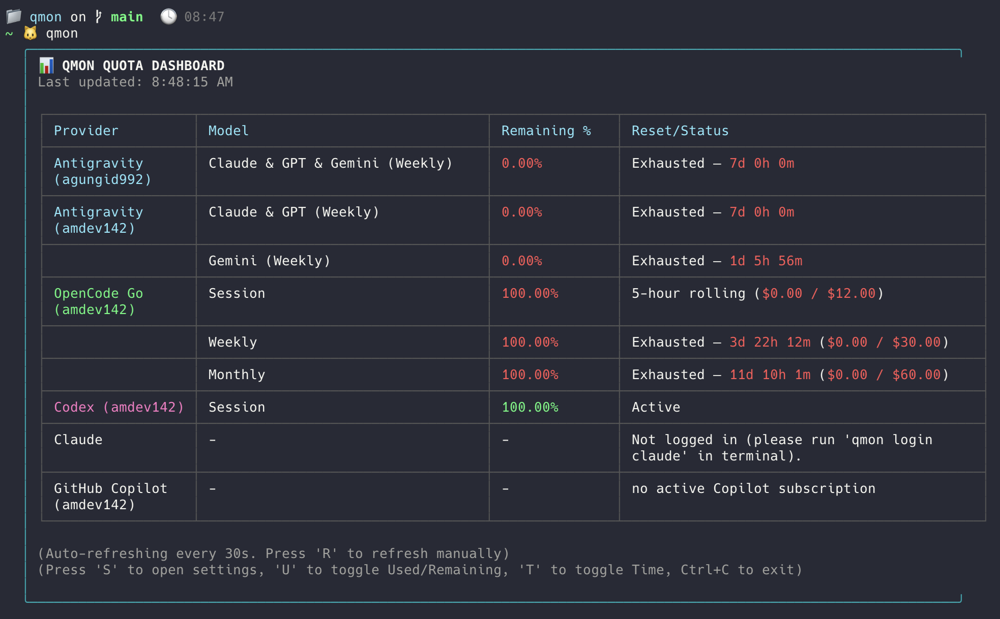
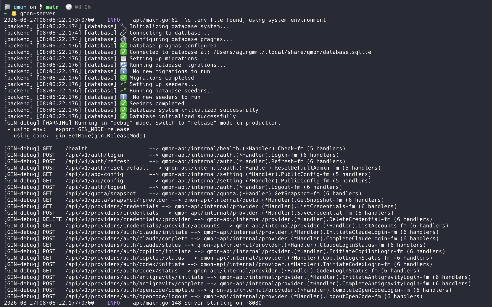
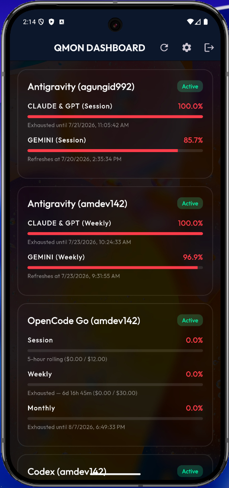
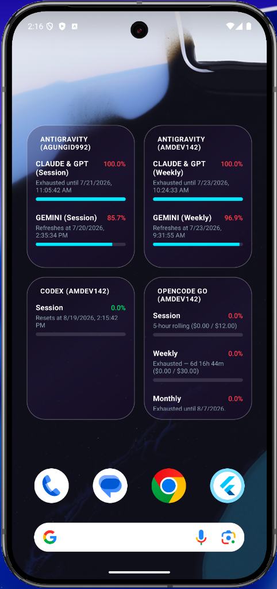

<h1 align="center">Qmon</h1>

<p align="center">
  <strong>Monitor your AI quotas instantly.</strong><br />
  Terminal Dashboard, Mobile App, and Background API Daemon
</p>

<p align="center">
  <a href="https://github.com/IDNCraft/qmon/issues">Issues</a> ·
  <a href="https://github.com/IDNCraft/qmon/pulls">Pull Requests</a>
</p>

<p align="center">
  <a href="LICENSE"></a>
  <a href="https://github.com/rust142/qmon/pulls"></a>
  <a href="https://golang.org"></a>
  <a href="https://bun.sh"></a>
  <a href="https://flutter.dev"></a>
</p>

Qmon is a powerful Terminal User Interface (TUI), Mobile App, and Background API Daemon for monitoring and managing your AI Provider Quotas (Claude Code, OpenCode Go, GitHub Copilot, Codex, Antigravity.).

---

## Features

A complete ecosystem designed around keeping track of your AI usage, built to run seamlessly in the background and look beautiful everywhere.

- **Multi-Account Support** — Manage multiple accounts for your AI tools (e.g., Work, Personal) securely
- **Isolated Profiles** — Uses standard `XDG_CONFIG_HOME` and `XDG_DATA_HOME` variables to completely isolate your AI usage data without modifying your primary system configuration
- **Blazing Fast Concurrency** — Powered by Go Routines to probe all active providers in parallel, ensuring instant dashboard loads
- **Real-Time Monitoring** — Automatically scans underlying SQLite databases and configuration files to report exact quota usage across all accounts
- **Interactive TUI** — Built with React Ink for an aesthetic and highly responsive terminal dashboard
- **Mobile Companion App** — Beautiful Flutter-based mobile dashboard for checking quotas on the go
- **Android Home Widget** — Native Android widget to view real-time API quota limits right from your home screen

---

## Quick Start

### Prerequisites

- [Go](https://go.dev/dl/) v1.26.2+
- [Bun](https://bun.sh/) v1.0+
- [Flutter](https://flutter.dev/) *(Optional, required only for mobile app)*

### Installation

Qmon provides a one-liner installation script that builds and installs `qmon` and `qmon-server` into your `~/.local/bin` folder.

```bash
curl -fsSL https://raw.githubusercontent.com/IDNCraft/qmon/master/scripts/install.sh | bash
```

> [!IMPORTANT]
> The installer adds `~/.local/bin` to the detected shell configuration automatically. Open a new terminal after installation so the updated `PATH` is loaded.

### Usage

**1. Standalone Terminal Usage**

If you only want to check your quotas from the terminal, simply run:

```bash
qmon
```

<p align="center">
  
</p>

*(Note: The CLI automatically starts the API daemon for you in the background and gracefully shuts it down when you exit.)*

**2. Always-On API Daemon (For Mobile & Widget)**

If you want your Mobile App and Android Widget to sync 24/7 without needing the terminal dashboard open, you must run the API daemon permanently:

```bash
qmon-server
```

<p align="center">
  
</p>

> [!TIP]
> `qmon-server` reads quota data and provider configuration from the machine where it runs. Run it on an always-on server, VPS, or homelab only when the required provider accounts and data are available there. Otherwise, keep it running on your personal computer; the mobile app and widget will be unavailable when that computer sleeps or disconnects.

**3. Account Management**

To log in to an AI provider (e.g., OpenCode Go):

```bash
qmon login opencode
```

To log out:

```bash
qmon logout opencode
```

**Mobile Companion App & Widget**

Once `qmon-server` is running on your machine, you can build and install the mobile app to your Android device:

```bash
cd mobile
flutter pub get

# Option 1: Install directly to a connected phone
flutter run --release

# Option 2: Build an APK file to install manually later
flutter build apk
```

To use the Android Home Widget:

1. Long-press on your Android home screen and select **Widgets**.
2. Scroll down to **Qmon** and drag the widget to your home screen.
3. Open the Qmon app, tap the **Settings (Gear)** icon, and configure the API URL to point to your computer's local IP address (e.g., `http://192.168.1.100:8080`). Ensure both devices are on the same Wi-Fi network.

<p align="center">
  
  &nbsp;&nbsp;&nbsp;&nbsp;
  
</p>

---

## Architecture

| Layer | Technology |
| ------- | ----------- |
| Backend Daemon | Go + Goroutines |
| CLI Frontend | Bun + React Ink |
| Mobile App | Flutter |
| Mobile Widget | Native Android (Kotlin + XML) |
| Data Source | Local SQLite & Config Files |

---

## Contributing

Contributions are welcome! Since Qmon is a monorepo, you can develop the CLI, backend, and mobile app in tandem.

```bash
git clone git@github.com:IDNCraft/qmon.git
cd qmon
bash scripts/install.sh
```

Check out the `api`, `cli`, and `mobile` directories for their respective source codes. Feel free to open an issue or submit a pull request.

---

## License

MIT License - see [LICENSE](LICENSE) for details.
